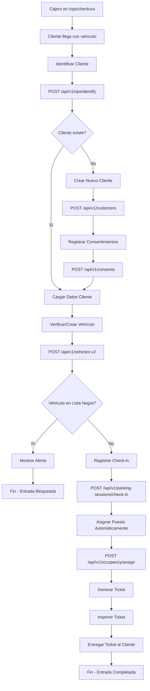
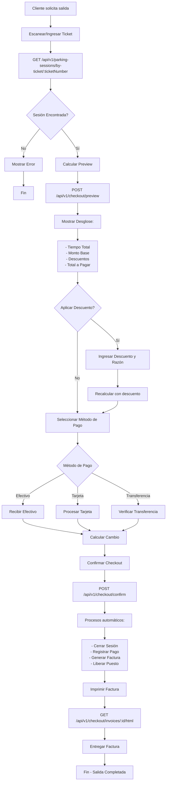
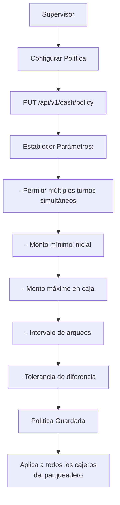
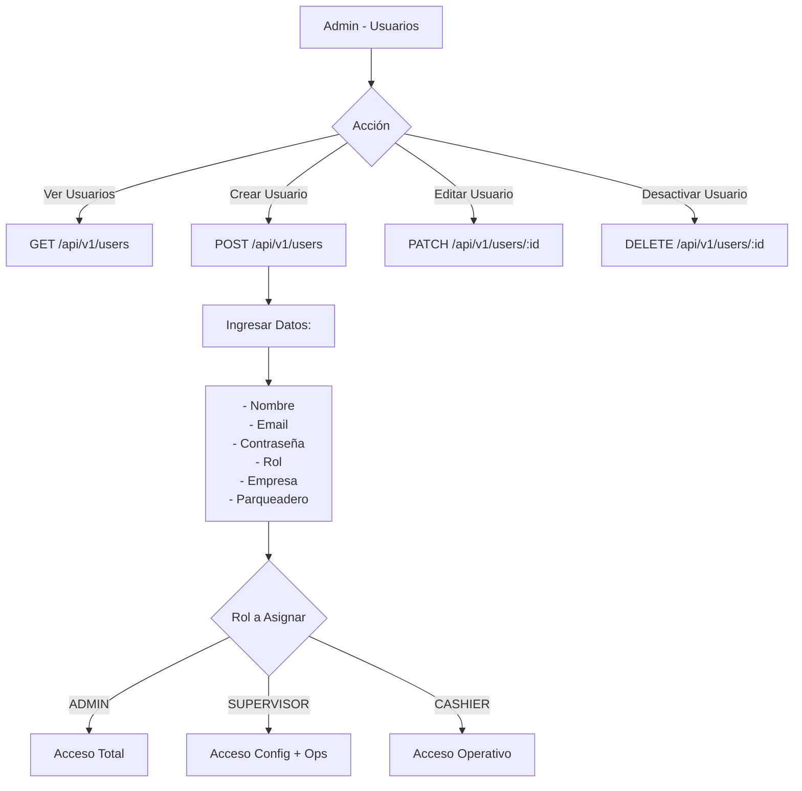
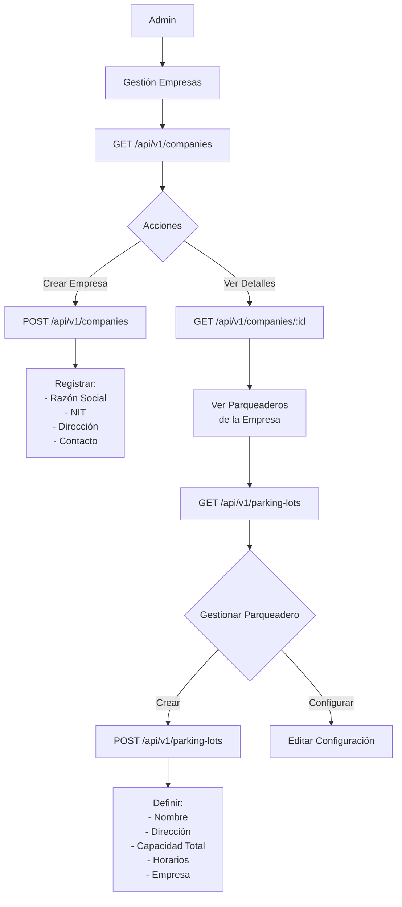

# Diagramas de Flujo por Tipo de Usuario
## Sistema de Gestión de Parqueaderos

---

## CREDENCIALES DE ACCESO AL SISTEMA

Para probar el sistema, puede utilizar las siguientes credenciales según el rol que desee explorar:

### 👤 Administrador (ADMIN)
- **Email:** `admin@demo.com`
- **Contraseña:** `Admin123*`
- **Permisos:** Acceso completo a todas las funcionalidades del sistema
- **Descripción:** Usuario con permisos totales para gestionar empresas, parqueaderos, usuarios, configuraciones y auditoría

### 👥 Supervisor
- **Email:** `supervisor@demo.com`
- **Contraseña:** `Super123*`
- **Permisos:** Operaciones del cajero + configuración y supervisión
- **Descripción:** Usuario con capacidad de configurar precios, zonas, puestos, políticas de caja y acceso a reportes históricos

### 💰 Cajero (CASHIER)
- **Email:** `cajero@demo.com`
- **Contraseña:** `Cajero123*`
- **Permisos:** Operaciones de entrada/salida, checkout y gestión de caja
- **Descripción:** Usuario operativo para el día a día del parqueadero

---

## 1. ROL: CAJERO (CASHIER)

El cajero es el usuario operativo principal que gestiona las operaciones diarias del parqueadero.

### Flujo Principal de Cajero

```mermaid
graph TD
    A[Inicio de Sesión] --> B{Autenticación Exitosa}
    B -->|Sí| C[Dashboard Principal]
    B -->|No| A
    
    C --> D{Tiene Turno Abierto?}
    D -->|No| E[Mostrar Alerta en Dashboard]
    D -->|Sí| F[Ver Dashboard con KPIs]
    
    E --> E1[Botón: Abrir Turno de Caja]
    E1 --> E2[/cash/open]
    E2 --> E3[Registrar Monto Inicial]
    E3 --> F
    
    F --> G{Seleccionar Operación}
    
    G -->|1| H[Operaciones de Entrada/Salida]
    G -->|2| I[Gestión de Checkout]
    G -->|3| J[Consultas y Búsquedas]
    G -->|4| K[Gestión de Caja]
    G -->|5| L[Cerrar Sesión]
    
    H --> H1[Ir a /ops/checkout o usar modales]
    I --> I1[Ir a /ops/checkout o usar modales]
    J --> J1[Usar funciones del Dashboard]
    K --> K1[Ir a /cash]
    L --> L1[Logout]
```

### Subproceso 1: Registro de Entrada de Vehículo



### Subproceso 2: Checkout y Cobro



### Subproceso 3: Gestión de Turno de Caja

```mermaid
graph TD
    A[Inicio Turno] --> B[/cash/open]
    B --> C[Registrar Monto Inicial]
    C --> C1[POST /api/v1/cash/shifts/open]
    
    C1 --> D[Durante el Turno]
    D --> E{Operaciones}
    
    E -->|Registro Ingresos/Egresos| F[/cash/movements]
    E -->|Realizar Arqueo| G[/cash/count]
    E -->|Ver Resumen| H[Ver Dashboard]
    E -->|Fin de Turno| I[Cerrar Turno]
    
    F --> F1[POST /api/v1/cash/movements]
    F1 --> F2[Especificar:<br/>- Tipo: INCOME/EXPENSE<br/>- Monto<br/>- Concepto]
    F2 --> D
    
    G --> G1[POST /api/v1/cash/counts]
    G1 --> G2[Registrar Conteo Físico]
    G2 --> G3[Por Método de Pago:<br/>- Efectivo (denominaciones)<br/>- Tarjeta<br/>- Transferencia]
    G3 --> D
    
    I --> I1[/cash/close]
    I1 --> I2[POST /api/v1/cash/shifts/:id/close]
    I2 --> I3[Validar Arqueo Final]
    I3 --> I4{Diferencia?}
    
    I4 -->|Sí| I5[Registrar Diferencia<br/>y Observaciones]
    I4 -->|No| I6[Cierre Normal]
    
    I5 --> I7[Generar Reporte de Cierre]
    I6 --> I7
    I7 --> I8[Fin del Turno]
```

### Subproceso 4: Consultas del Cajero

```mermaid
graph TD
    A[Dashboard Cajero] --> B{Tipo de Consulta}
    
    B -->|Tickets Activos| C[/dashboard/tickets/active]
    B -->|Ocupación| D[/dashboard/occupancy]
    B -->|Buscar Cliente| E[/dashboard/customers]
    B -->|Buscar Vehículo| F[/dashboard/vehicles]
    B -->|Ver Facturas| G[/ops/invoices]
    B -->|Ver Pagos| H[/ops/payments]
    
    C --> C1[GET /api/v1/tickets/active]
    C1 --> C2[Ver Lista de Vehículos<br/>Actualmente en Parqueadero]
    
    D --> D1[GET /api/v1/occupancy/summary]
    D1 --> D2[Ver Estado de Puestos:<br/>- Disponibles<br/>- Ocupados<br/>- Fuera de Servicio]
    
    E --> E1[GET /api/v1/customers/search]
    E1 --> E2[Buscar por:<br/>- Nombre<br/>- Documento<br/>- Email]
    
    F --> F1[GET /api/v1/vehicles-v2/search]
    F1 --> F2[Buscar por:<br/>- Placa<br/>- Código Bici]
    
    G --> G1[GET /api/v1/checkout/invoices]
    G1 --> G2[Ver Facturas Emitidas]
    
    H --> H1[GET /api/v1/payments]
    H1 --> H2[Ver Pagos Registrados]
```

---

## 2. ROL: SUPERVISOR

El supervisor tiene todos los permisos del cajero MÁS funciones de configuración y supervisión.

### Flujo Principal de Supervisor

```mermaid
graph TD
    A[Inicio de Sesión] --> B[Dashboard Supervisor]
    B --> C{Seleccionar Área}
    
    C -->|Operaciones| D[Funciones de Cajero]
    C -->|Configuración| E[Gestión de Configuración]
    C -->|Reportes| F[Visualizar Reportes]
    C -->|Administración| G[Gestión Avanzada]
    
    D --> D1[Todas las operaciones<br/>del Cajero disponibles]
    
    E --> E1{Tipo de Configuración}
    E1 -->|Precios| E2[/dashboard/pricing]
    E1 -->|Zonas| E3[/dashboard/zones]
    E1 -->|Puestos| E4[/dashboard/spots]
    E1 -->|Política de Caja| E5[Configurar Políticas]
    
    F --> F1[Ver Historial Completo]
    F1 --> F2[GET /api/v1/tickets/history]
    F2 --> F3[Filtrar por fechas]
    
    G --> G1{Gestión}
    G1 -->|Vehículos| G2[Bloquear/Desbloquear]
    G1 -->|Plantillas Tickets| G3[Configurar Templates]
    G1 -->|Turnos| G4[Ver Todos los Turnos]
```

### Subproceso: Configuración de Precios

```mermaid
graph TD
    A[/dashboard/pricing] --> B[GET /api/v1/pricing/plans]
    B --> C{Acción}
    
    C -->|Ver Planes| D[Listar Planes Actuales]
    C -->|Crear Plan| E[Nuevo Plan de Precios]
    C -->|Editar Plan| F[Modificar Plan Existente]
    C -->|Activar Plan| G[Cambiar Plan Activo]
    
    E --> E1[POST /api/v1/pricing/plans]
    E1 --> E2[Configurar:<br/>- Nombre<br/>- Descripción<br/>- Vigencia]
    E2 --> E3[Agregar Reglas de Precio]
    
    E3 --> E4[POST /api/v1/pricing/rules]
    E4 --> E5[Por cada regla:<br/>- Tipo Vehículo<br/>- Tarifa Base<br/>- Tarifa por Hora<br/>- Horarios<br/>- Días]
    
    G --> G1[POST /api/v1/pricing/plans/:id/activate]
    G1 --> G2[Plan Activado]
```

### Subproceso: Configuración de Zonas y Puestos

```mermaid
graph TD
    A[/dashboard/zones] --> B{Gestión de Zonas}
    
    B -->|Ver Zonas| C[GET /api/v1/zones]
    B -->|Crear Zona| D[POST /api/v1/zones]
    B -->|Editar Zona| E[PATCH /api/v1/zones/:id]
    
    D --> D1[Especificar:<br/>- Nombre<br/>- Descripción<br/>- Piso/Nivel]
    
    E --> F[Ir a /dashboard/spots]
    F --> G{Gestión de Puestos}
    
    G -->|Ver Puestos| H[GET /api/v1/spots]
    G -->|Crear Puesto| I[POST /api/v1/spots]
    G -->|Editar Puesto| J[PATCH /api/v1/spots/:id]
    G -->|Cambiar Estado| K[POST /api/v1/spots/:id/status]
    
    I --> I1[Configurar:<br/>- Código/Número<br/>- Zona<br/>- Tipo Vehículo<br/>- Estado]
    
    K --> K1[Estados:<br/>- AVAILABLE<br/>- OCCUPIED<br/>- OUT_OF_SERVICE<br/>- RESERVED]
```

### Subproceso: Configuración de Política de Caja



---

## 3. ROL: ADMINISTRADOR (ADMIN)

El administrador tiene acceso completo a todas las funcionalidades del sistema.

### Flujo Principal de Administrador

```mermaid
graph TD
    A[Inicio de Sesión Admin] --> B[Dashboard Completo]
    B --> C{Área de Gestión}
    
    C -->|Operaciones| D[Todas las funciones<br/>de Cajero y Supervisor]
    C -->|Usuarios| E[Gestión de Usuarios]
    C -->|Empresas| F[Gestión de Empresas]
    C -->|Parqueaderos| G[Gestión de Parqueaderos]
    C -->|Auditoría| H[Logs de Auditoría]
    C -->|Reportes| I[Reportes Ejecutivos]
    
    E --> E1[/dashboard/users]
    F --> F1[GET /api/v1/companies]
    G --> G1[GET /api/v1/parking-lots]
    H --> H1[GET /api/v1/audit]
    I --> I1[Dashboard Analytics]
```

### Subproceso: Gestión de Usuarios



### Subproceso: Gestión de Empresas y Parqueaderos



### Subproceso: Auditoría y Logs

```mermaid
graph TD
    A[Admin - Auditoría] --> B[GET /api/v1/audit]
    B --> C[Filtrar por:]
    
    C --> C1[- Usuario]
    C1 --> C2[- Acción<br/>(CREATE, UPDATE, DELETE)]
    C2 --> C3[- Entidad]
    C3 --> C4[- Rango de Fechas]
    
    C4 --> D[Ver Registro Completo]
    D --> D1[Para cada evento:]
    D1 --> D2[- Timestamp<br/>- Usuario<br/>- IP<br/>- Acción<br/>- Entidad<br/>- Cambios (before/after)]
```

---

## 4. FLUJO GENERAL DE NAVEGACIÓN

### Mapa de Sitio por Rol

```mermaid
graph TD
    A[Login] --> B{Rol Autenticado}
    
    B -->|CASHIER| C[Dashboard Cajero]
    B -->|SUPERVISOR| D[Dashboard Supervisor]
    B -->|ADMIN| E[Dashboard Admin]
    
    C --> C1[/ops/checkout<br/>Operaciones Principales]
    C --> C2[/cash<br/>Gestión de Caja]
    C --> C3[/dashboard<br/>Consultas Básicas]
    
    D --> D1[Acceso a todas<br/>las rutas de Cajero]
    D --> D2[/dashboard/pricing<br/>Configuración Precios]
    D --> D3[/dashboard/zones<br/>Zonas y Puestos]
    D --> D4[/dashboard/tickets<br/>Historial Completo]
    
    E --> E1[Acceso Total]
    E1 --> E2[/dashboard/users<br/>Usuarios]
    E1 --> E3[/api/v1/companies<br/>Empresas]
    E1 --> E4[/api/v1/parking-lots<br/>Parqueaderos]
    E1 --> E5[/api/v1/audit<br/>Auditoría]
```

---

## 5. LEYENDA DE PERMISOS POR ENDPOINT

### Matriz de Acceso

| Módulo | Endpoint | CASHIER | SUPERVISOR | ADMIN |
|--------|----------|:-------:|:----------:|:-----:|
| **Auth** |
| | POST /auth/login | ✅ | ✅ | ✅ |
| **Parking Sessions** |
| | POST /parking-sessions/check-in | ✅ | ✅ | ✅ |
| | POST /parking-sessions/check-out | ✅ | ✅ | ✅ |
| | GET /parking-sessions/active | ✅ | ✅ | ✅ |
| **Checkout** |
| | POST /checkout/preview | ✅ | ✅ | ✅ |
| | POST /checkout/confirm | ✅ | ✅ | ✅ |
| | GET /checkout/invoices | ✅ | ✅ | ✅ |
| **Customers** |
| | POST /customers | ✅ | ✅ | ✅ |
| | GET /customers/search | ✅ | ✅ | ✅ |
| | PATCH /customers/:id | ⚠️ Limitado | ✅ | ✅ |
| **Vehicles** |
| | POST /vehicles-v2 | ✅ | ✅ | ✅ |
| | GET /vehicles-v2/search | ✅ | ✅ | ✅ |
| | PATCH /vehicles-v2/:id | ⚠️ Limitado | ✅ | ✅ |
| **Cash Management** |
| | POST /cash/shifts/open | ✅ | ✅ | ✅ |
| | POST /cash/shifts/:id/close | ✅ | ✅ | ✅ |
| | POST /cash/movements | ✅ | ✅ | ✅ |
| | POST /cash/counts | ✅ | ✅ | ✅ |
| | GET /cash/policy | ✅ | ✅ | ✅ |
| | PUT /cash/policy | ❌ | ✅ | ✅ |
| **Pricing** |
| | GET /pricing/plans | ✅ | ✅ | ✅ |
| | POST /pricing/plans | ❌ | ✅ | ✅ |
| | POST /pricing/quote | ✅ | ✅ | ✅ |
| **Zones & Spots** |
| | GET /zones | ✅ | ✅ | ✅ |
| | POST /zones | ❌ | ✅ | ✅ |
| | GET /spots | ✅ | ✅ | ✅ |
| | POST /spots | ❌ | ✅ | ✅ |
| | POST /spots/:id/status | ❌ | ✅ | ✅ |
| **Tickets** |
| | GET /tickets/active | ✅ | ✅ | ✅ |
| | GET /tickets/history | ❌ | ✅ | ✅ |
| **Users** |
| | GET /users | ❌ | ❌ | ✅ |
| | POST /users | ❌ | ❌ | ✅ |
| **Audit** |
| | GET /audit | ❌ | ❌ | ✅ |

**Leyenda:**
- ✅ Acceso completo
- ⚠️ Acceso limitado (solo ciertos campos)
- ❌ Sin acceso

---

## 6. CASOS DE USO ESPECÍFICOS

### Caso de Uso 1: Día Típico de un Cajero

**Credenciales:** cajero@demo.com / Cajero123*

```
1. 08:00 - Login al sistema (cajero@demo.com / Cajero123*)
   - El sistema redirige automáticamente al /dashboard
   
2. 08:01 - Dashboard verifica turno de caja
   - Si NO hay turno abierto: Muestra alerta y botón "Abrir Turno de Caja"
   - El cajero hace clic en "Abrir Turno de Caja"
   
3. 08:05 - Abrir turno de caja (/cash/open)
   - Registrar monto inicial: $100,000
   - Confirmar apertura
   - Sistema redirige al dashboard con turno activo
   
4. 08:10 - Dashboard con turno abierto
   - Ve KPIs: vehículos activos, espacios disponibles, ingresos del día
   - Ve tarjetas de registro por tipo de vehículo
   
5. 08:15 - Primer vehículo llega
   - Click en tarjeta del tipo de vehículo (ej: Auto)
   - Se abre modal de Check-In
   - Identificar cliente (placa ABC123)
   - Registrar entrada
   - Asignar puesto automático
   - Imprimir ticket
   
6. Durante el día:
   - Procesar 50+ entradas usando modales del dashboard
   - Procesar salidas usando botón "Registrar Salida" o /ops/checkout
   - Realizar arqueo cada 4 horas (/cash/count)
   - Registrar gastos menores (/cash/movements)
   
7. 18:00 - Fin de turno
   - Ir a /cash desde el menú lateral
   - Click en "Cerrar Caja"
   - Ir a /cash/close
   - Realizar arqueo final
   - Cerrar turno
   - Generar reporte
   
8. 18:15 - Logout
```

### Caso de Uso 2: Supervisor Configurando Precios

**Credenciales:** supervisor@demo.com / Super123*

```
1. Login como SUPERVISOR (supervisor@demo.com / Super123*)
2. Ir a /dashboard/pricing
3. Crear nuevo plan:
   - Nombre: "Tarifas Fin de Semana"
   - Vigencia: Sábados y Domingos
4. Agregar reglas:
   - Bicicleta: $1,000/hora
   - Moto: $2,000/hora
   - Carro: $3,000/hora
   - Camión: $5,000/hora
5. Revisar y activar plan
6. Verificar en simulador de precios
```

### Caso de Uso 3: Admin Creando Nuevo Usuario

**Credenciales:** admin@demo.com / Admin123*

```
1. Login como ADMIN (admin@demo.com / Admin123*)
2. Ir a gestión de usuarios
3. Crear nuevo usuario:
   - Nombre: Juan Pérez
   - Email: juan@parking.com
   - Rol: CASHIER
   - Empresa: Parqueaderos XYZ
   - Parqueadero: Centro Comercial
4. Asignar permisos
5. Enviar credenciales
6. Verificar en log de auditoría
```

---

## NOTAS IMPORTANTES

1. **Seguridad**: Todos los endpoints requieren JWT (excepto login)
2. **Multi-tenant**: Los datos se filtran por companyId automáticamente
3. **Auditoría**: Todas las acciones se registran en audit_logs
4. **Sesiones**: Los cajeros deben tener un turno abierto para operar
   - El **Dashboard Principal** verifica automáticamente si hay turno abierto
   - Si NO hay turno abierto, muestra alerta y botón "Abrir Turno de Caja"
   - Si SÍ hay turno abierto, muestra dashboard completo con KPIs y operaciones
5. **Tiempo Real**: El dashboard se actualiza automáticamente
6. **Impresión**: Las facturas y tickets se pueden imprimir directamente
7. **Offline**: Algunas funciones pueden trabajar offline (futuro)
8. **Flujo de Trabajo**:
   - Login → Dashboard Principal → Verificación de Turno → Operaciones
   - El cajero NO necesita ir manualmente a /cash al inicio del día
   - El dashboard lo guía automáticamente si necesita abrir caja

---

**Fecha de Creación**: 22 de enero de 2026
**Versión**: 1.0
**Estado**: Documentación Oficial del Sistema
