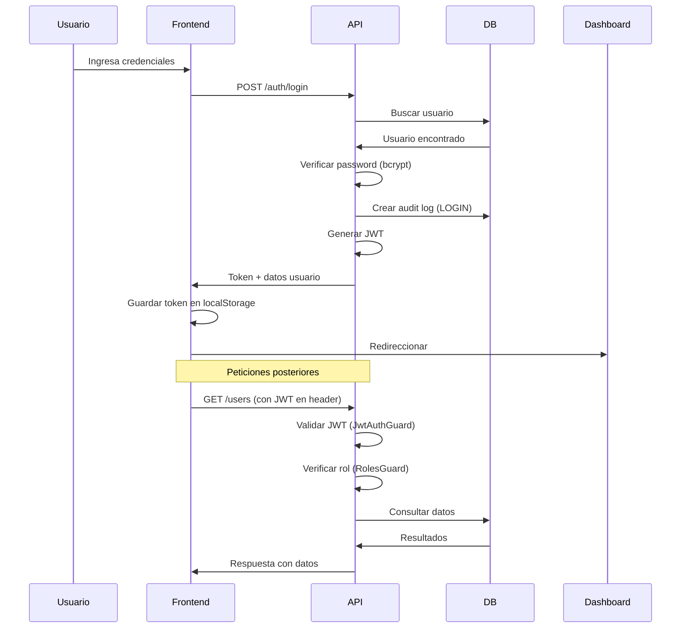

# Arquitectura del Sistema 🏗️

## Visión General

El sistema de gestión de parqueaderos está construido con una arquitectura **monorepo** que separa claramente el backend (API) y el frontend (Web), facilitando el desarrollo, despliegue y mantenimiento independiente de cada capa.

## Stack Tecnológico

### Backend (NestJS)
- **Framework**: NestJS v10
- **Lenguaje**: TypeScript
- **ORM**: TypeORM
- **Base de Datos**: PostgreSQL 16
- **Autenticación**: JWT (Passport)
- **Validación**: class-validator, class-transformer
- **Documentación**: Swagger/OpenAPI
- **Seguridad**: Helmet, bcrypt

### Frontend (Next.js)
- **Framework**: Next.js v14 (App Router)
- **Lenguaje**: TypeScript
- **Estilos**: TailwindCSS
- **HTTP Client**: Axios
- **State Management**: TanStack Query
- **Validación**: Zod + React Hook Form

## Estructura Backend

### Módulos Principales

#### 1. **Auth Module**
Maneja autenticación y autorización.

**Responsabilidades:**
- Login de usuarios
- Generación de JWT
- Validación de tokens
- Registro de auditoría de logins

**Endpoints:**
- `POST /auth/login` - Iniciar sesión

**Estrategias:**
- JWT Strategy (passport-jwt)

**Guards:**
- `JwtAuthGuard` - Protege rutas que requieren autenticación
- `RolesGuard` - Controla acceso basado en roles

#### 2. **Users Module**
Gestión de usuarios del sistema.

**Entidad: User**
```typescript
{
  id: uuid
  companyId: uuid
  parkingLotId: uuid (nullable)
  fullName: string
  email: string (unique)
  passwordHash: string
  role: ADMIN | SUPERVISOR | CASHIER
  isActive: boolean
  createdAt: timestamp
  updatedAt: timestamp
}
```

**Roles:**
- **ADMIN**: Acceso total al sistema
- **SUPERVISOR**: Gestión operativa (usuarios, configuración)
- **CASHIER**: Operación diaria (tickets, cobros)

**Endpoints:**
- `GET /users` - Listar usuarios (Admin, Supervisor)
- `GET /users/:id` - Ver usuario (Admin, Supervisor)

#### 3. **Companies Module**
Gestión de empresas (multi-tenancy).

**Entidad: Company**
```typescript
{
  id: uuid
  name: string
  nit: string (nullable)
  isActive: boolean
  createdAt: timestamp
  updatedAt: timestamp
}
```

**Endpoints:**
- `GET /companies` - Listar empresas (Admin)

#### 4. **Parking Lots Module**
Gestión de parqueaderos.

**Entidad: ParkingLot**
```typescript
{
  id: uuid
  companyId: uuid
  name: string
  address: string
  legalName: string
  legalNit: string
  ticketHeader: jsonb {
    companyName, nit, address, 
    phone, email, footerText
  }
  isActive: boolean
  createdAt: timestamp
  updatedAt: timestamp
}
```

**Endpoints:**
- `GET /parking-lots` - Listar parqueaderos de la empresa

#### 5. **Audit Module**
Sistema de auditoría automática.

**Entidad: AuditLog**
```typescript
{
  id: uuid
  companyId: uuid
  parkingLotId: uuid (nullable)
  actorUserId: uuid (nullable)
  entityName: string
  entityId: uuid
  action: CREATE | UPDATE | DELETE | RESTORE | LOGIN
  before: jsonb
  after: jsonb
  ip: string
  userAgent: string
  createdAt: timestamp
}
```

**Endpoints:**
- `GET /audit?entityName=&action=&from=&to=` - Consultar logs (Admin)

**Características:**
- Registro automático de cambios en entidades críticas
- Captura de estado anterior y posterior
- Tracking de usuario, IP y user-agent
- Filtrado por entidad, acción y rango de fechas

### Capa Common

#### Decorators
- `@GetUser()` - Obtiene usuario autenticado del request
- `@Roles(...roles)` - Define roles permitidos para un endpoint

#### Guards
- `JwtAuthGuard` - Verifica JWT válido
- `RolesGuard` - Verifica roles del usuario

#### Filters
- `HttpExceptionFilter` - Manejo global de errores

#### Interceptors
- `TransformInterceptor` - Estandariza formato de respuestas

### Database

**Configuración:**
- TypeORM con migraciones
- Data Source centralizado
- Synchronize: false (siempre usar migraciones)

**Migraciones:**
- Ubicación: `src/database/migrations/`
- Comando generar: `npm run migration:generate`
- Comando ejecutar: `npm run migration:run`

**Seeds:**
- Ubicación: `src/database/seeds/`
- Datos demo: 1 empresa, 1 parqueadero, 3 usuarios
- Comando: `npm run seed`

## Estructura Frontend

### Páginas

#### `/` (Home)
- Página de bienvenida
- Links a login y dashboard

#### `/login`
- Formulario de autenticación
- Validación con Zod
- Manejo de errores
- Almacenamiento de token en localStorage

#### `/dashboard`
- Vista protegida (requiere autenticación)
- Información del usuario autenticado
- Placeholders para métricas (próximos sprints)
- Logout

### Componentes

#### `Providers`
- Configura React Query
- Envuelve la aplicación

### Librerías

#### `api.ts`
- Cliente Axios configurado
- Interceptor para agregar JWT
- Interceptor para manejo de errores 401
- Base URL desde variables de entorno

### Tipos

#### `auth.ts`
- Interfaces de autenticación
- Enums de roles
- Tipos de usuario

## Flujo de Autenticación



## Modelo de Datos

### Relaciones

```
Company (1) ─── (N) ParkingLot
   │                    │
   │                    │
   └─── (N) User ───(1)─┘
         │
         │
         └─── (N) AuditLog
```

**Cascade:**
- Al eliminar Company: se eliminan ParkingLots, Users y AuditLogs
- Al eliminar ParkingLot: se pone null en Users y AuditLogs

**Índices:**
- `users.email` (unique)
- `companies.name`
- `parking_lots.company_id`
- `users.company_id`
- `users.parking_lot_id`
- `audit_logs.company_id`
- `audit_logs.entity_name`
- `audit_logs.created_at`

## Seguridad

### Backend

1. **Autenticación**
   - JWT con expiración configurable
   - Tokens validados en cada request protegido
   - Refresh tokens: pendiente (Sprint futuro)

2. **Autorización**
   - Guards a nivel de endpoint
   - Roles: Admin, Supervisor, Cashier
   - Scope a nivel de empresa (multi-tenancy)

3. **Validación**
   - DTOs con class-validator
   - ValidationPipe global
   - Whitelist activado (elimina propiedades no definidas)

4. **Headers de seguridad**
   - Helmet configurado
   - CORS con origen específico

5. **Passwords**
   - Bcrypt con 10 rounds
   - Nunca se retornan en responses (class-transformer @Exclude)

### Frontend

1. **Tokens**
   - Almacenados en localStorage (desarrollo)
   - TODO: Migrar a httpOnly cookies (producción)

2. **Rutas protegidas**
   - Verificación de token antes de renderizar
   - Redirección a login si no autenticado

3. **Validación de formularios**
   - Zod schemas
   - Validación client-side antes de enviar

## Variables de Entorno

### Backend (.env)

```env
NODE_ENV=development
PORT=3001
API_PREFIX=api/v1

# Database
DB_HOST=localhost
DB_PORT=5432
DB_USERNAME=parking_user
DB_PASSWORD=parking_pass_2026
DB_DATABASE=parking_system

# JWT
JWT_SECRET=your-secret-key
JWT_EXPIRATION=7d

# CORS
CORS_ORIGIN=http://localhost:3000

# Logging
LOG_LEVEL=debug
```

### Frontend (.env.local)

```env
NEXT_PUBLIC_API_URL=http://localhost:3001/api/v1
```

## Convenciones de Código

### Backend

- **Naming**: camelCase para variables/funciones, PascalCase para clases
- **DTOs**: Sufijo `Dto` (ej: `CreateUserDto`)
- **Entities**: Sin sufijo (ej: `User`)
- **Services**: Sufijo `Service` (ej: `UsersService`)
- **Controllers**: Sufijo `Controller`
- **Modules**: Sufijo `Module`

### Frontend

- **Componentes**: PascalCase, un componente por archivo
- **Hooks**: Prefijo `use` (ej: `useAuth`)
- **Utils**: camelCase
- **Tipos**: PascalCase con sufijo según contexto

## Próximas Mejoras

### Backend
- [ ] Refresh tokens
- [ ] Rate limiting
- [ ] Logging avanzado (Winston/Pino)
- [ ] Tests unitarios y e2e
- [ ] Websockets para actualizaciones en tiempo real
- [ ] File uploads (imágenes de vehículos)

### Frontend
- [ ] Middleware de autenticación Next.js
- [ ] Cookie httpOnly para tokens
- [ ] PWA
- [ ] Internacionalización (i18n)
- [ ] Temas (dark mode)
- [ ] Tests con Jest/Testing Library

### Infraestructura
- [ ] CI/CD
- [ ] Docker para desarrollo completo
- [ ] Kubernetes para producción
- [ ] Monitoreo (APM)
- [ ] Backup automatizado

---

**Última actualización**: Enero 2026
